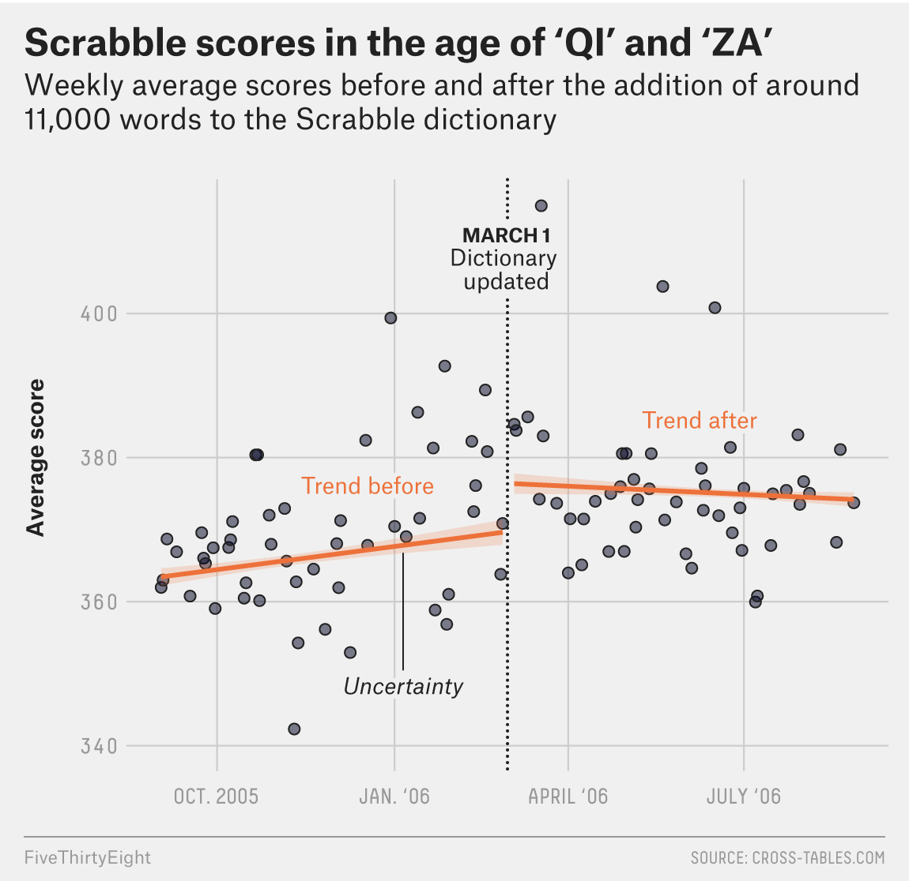

# Loading required packages
```{r}
library(tidyverse)
library(usmap)
library(knitr)
library(here)
library(dplyr)
library(scales)
library(lubridate)
```
For this exercise, I'll recreate a graphic from FiveThirtyEight which demonstrates how Scrabble scores increased following a rule change incorporating new words. The link to the original article can be found [here](https://fivethirtyeight.com/features/how-qi-and-za-changed-scrabble/)

# The visual I want to recreate
```{r, echo=FALSE, out.width='50%', fig.align='center'}

```

# Loading data
```{r}
file <- "https://media.githubusercontent.com/media/fivethirtyeight/data/master/scrabble-games/scrabble_games.csv"
data <- read.csv(file, header = TRUE)
```
# Look at data
```{r}
dplyr::glimpse(data)
```

There are a good amount of variables in this dataset, but I know I mainly need the date and score variables, so I can clean up this dataset a bit. There are also some observations with negative scores or scores of 0 for both the winner and the loser, so let's eliminate those. I'm filtering to keep winning scores greater than 0 (assuming that winning scores recorded as 0 are incorrect/not possible) and losing scores greater than or equal to 0 (assuming a losing score of 0, recorded with a an actual winning score, is correct)
# Wrangling data
```{r}
cleandata <- data %>% select("winnerscore", "loserscore", "date") %>% filter(winnerscore>0, loserscore>=0)
```
The visualization that I want to recreate does not discern between winning and losing scores, but just uses average score. Next, I need to combine the winning and losing score variables into one variable, average score. Another option is to gather the data into tidy format so that all of the scores fall under the same variable. Let's try that
# Consolidating scores
```{r}
cleandata <- gather(cleandata, key = result, value = score, 1:2) %>% select(date, score)
```
Now we just have dates and scores. In the visualization, scores are averaged by week. Let's see how the scatterplot looks before attempting this. 
# Initial scatterplot
```{r}
cleandata %>% ggplot(aes(x = date, y = score)) + geom_point()
```

This plot is a mess - let's continue to clean up the data by focusing on 2005 - present, which are the dates from the original figure. I'm having trouble filter the data though. 
```{r}
class(cleandata$date)
```

Now I see that the date column is a character Let's see if we can fix that.

# Convert character to date
```{r}
cleandata <- cleandata %>% mutate(date = as.Date(cleandata$date, format = "%Y-%m-%d"))
summary(cleandata)
class(cleandata$date)
```
Now it looks like we've successfully classified the date column. Now let's try filtering again. 
# Filter dates
```{r}
cleandata <- cleandata %>% filter(date>="2005-08-01" & date<="2006-08-01")
``` 

# Preview plot again
```{r}
cleandata %>% ggplot(aes(x = date, y = score)) + geom_point()
```

At this point, I think the main thing I need to do is group the scores by week and average them. 

# Assign weeks to scores
```{r}
weekdata <- cleandata %>% group_by(week = floor_date(date, "1 week")) %>% select(week, score) %>% glimpse()
```
Now, we have the scores assigned to weeks. From here, we can figure out the average score for each week. 

# Average scores
```{r}
weekdata <- weekdata %>% group_by(week) %>% summarize(avg_score=mean(score))
summary(weekdata)
glimpse(weekdata)
```
Now, I think the data is ready to go for the plot. Let's see what the scatterplot looks like now

# Preview plot
```{r}
weekdata %>% ggplot(aes(x = week, y = avg_score)) + geom_point()
```

It looks like we have the correct date range for the graph. Let's edit the labels and graph titles to match the original.

# Attempt to edit axis labels
```{r}
weekdata %>% ggplot(aes(x = week, y = avg_score)) + geom_point() + scale_x_date(date_breaks = "3 months", date_labels = "%b-%y")
```

I could use date_labels to adjust the format to say the full or abbreviated month names, or use the full or abbreviated years. However, in the original figure, there is a mixture of formats for the labelling so I am not sure how to approach formatting the individual ticks. Let's move on for now.  

# Editing labels
```{r}
#removing x axis label, adding y axis label
weekdata %>% ggplot(aes(x = week, y = avg_score)) + geom_point() + theme(axis.title.x=element_blank()) + ylab("Average score")
```

I also should adjust the scale of the y axis to match the original (340 to 400, by 20)

# Adjust plot range
```{r}
weekdata %>% ggplot(aes(x = week, y = avg_score), ylim=c(340, 400)) + geom_point() + theme(axis.title.x=element_blank()) + ylab("Average score") + scale_y_continuous(breaks = c(340, 360, 380, 400), limits = c(340, 420))
```

Now let's try to add the line for the March 1st change in rules
# Add line marking date of rule change
```{r}
weekdata %>% ggplot(aes(x = week, y = avg_score), ylim=c(340, 400)) + geom_point() + theme(axis.title.x=element_blank()) + ylab("Average score") + scale_y_continuous(breaks = c(340, 360, 380, 400), limits = c(340, 420)) + geom_vline(aes(xintercept = as.numeric(week[30])))
```

I had trouble getting a line at the March 5, 2006 date, but eventually decided to use the column number for the week of March 5, which is column 60. Now let's see if we can make the line dashed and add some text. 
# Labelling the line
```{r}
weekdata %>% ggplot(aes(x = week, y = avg_score), ylim=c(340, 400)) + geom_point() + theme(axis.title.x=element_blank()) + ylab("Average score") + scale_y_continuous(breaks = c(340, 360, 380, 400), limits = c(340, 420)) + geom_vline(aes(xintercept = as.numeric(week[30])))+
  annotate(geom="text",x=as.Date("2006-03-05"),
    y=410,label="MARCH 1",fontface="bold")+
  annotate(geom="text",x=as.Date("2006-03-05"),
    y=405,label="Dictionary updated")
```

Next, I can focus on adding the trendlines. Some Googling helped me figure out how to separate the trendline into segments. 

# Add trendlines
```{r}
weekdata %>% ggplot(aes(x = week, y = avg_score), ylim=c(340, 400)) + geom_point() + theme(axis.title.x=element_blank()) + ylab("Average score") + scale_y_continuous(breaks = c(340, 360, 380, 400), limits = c(340, 420)) + geom_vline(aes(xintercept = as.numeric(week[30])))+
  annotate(geom="text",x=as.Date("2006-03-05"),
    y=410,label="MARCH 1",fontface="bold")+
  annotate(geom="text",x=as.Date("2006-03-05"),
    y=405,label="Dictionary updated")+
  stat_smooth(method = "lm", formula = y ~ x, size = 0.75, se = TRUE, level = 0.40,
              color = "red", fill = "red", alpha = 0.2, 
              data = weekdata[weekdata$week < as.Date("2006-03-05"),]) + 
  stat_smooth(method = "lm", formula = y ~ x, size = 0.75, se = TRUE, level = 0.40,
              color = "forestgreen", fill = "forestgreen", alpha = 0.2,
              data = weekdata[weekdata$week >= as.Date("2006-03-05"),])
```

Alright, now we have some trendlines. I adjusted the level parameter by decreasing the confidence interval from 95% to 40% to achieve a similar look to the original figure. Now, I can try to adjust the color of the lines and points as well as add some more annotation. 

# Adjusting trendline color
```{r}
weekdata %>% ggplot(aes(x = week, y = avg_score), ylim=c(340, 400)) + geom_point(fill="azure4", pch=21) + 
  theme(axis.title.x=element_blank()) + ylab("Average score") + scale_y_continuous(breaks = c(340, 360, 380, 400), limits = c(340, 420)) + geom_vline(aes(xintercept = as.numeric(week[30])))+
  annotate(geom="text",x=as.Date("2006-03-05"),
    y=410,label="MARCH 1",fontface="bold")+
  annotate(geom="text",x=as.Date("2006-03-05"),
    y=405,label="Dictionary updated")+

  stat_smooth(method = "lm", formula = y ~ x, size = 0.75, se = TRUE, level = 0.40,
              color = "darkorange", fill = "darkorange", alpha = 0.2, 
              data = weekdata[weekdata$week < as.Date("2006-03-05"),]) + 
  stat_smooth(method = "lm", formula = y ~ x, size = 0.75, se = TRUE, level = 0.40,
              color = "darkorange", fill = "darkorange", alpha = 0.2,
              data = weekdata[weekdata$week >= as.Date("2006-03-05"),])
```

Ideally, I would like to decrease the font size for the annotation and make the March 5th line dotted. I also still need to add the text for before and after.

# Final product
```{r, out.width='100%', fig.align='center'}
weekdata %>% ggplot(aes(x = week, y = avg_score), ylim=c(340, 400)) + geom_point(fill="azure4", pch=21) + 
  theme(axis.title.x=element_blank()) + ylab("Average score") + scale_y_continuous(breaks = c(340, 360, 380, 400), limits = c(340, 420)) + theme(axis.text = element_text(size=6), axis.title=element_text(size=6))+
  geom_vline(aes(xintercept = as.numeric(week[30])))+
  annotate(geom="text",x=as.Date("2006-03-05"),
    y=410,label="MARCH 1",fontface="bold", size=2)+
  annotate(geom="text",x=as.Date("2006-03-05"),
    y=406,label="Dictionary", size=2)+
  annotate(geom="text",x=as.Date("2006-03-05"),
    y=402,label=" updated", size=2)+

  stat_smooth(method = "lm", formula = y ~ x, size = 0.75, se = TRUE, level = 0.40,
              color = "darkorange", fill = "darkorange", alpha = 0.2, 
              data = weekdata[weekdata$week < as.Date("2006-03-05"),]) + 
  stat_smooth(method = "lm", formula = y ~ x, size = 0.75, se = TRUE, level = 0.40,
              color = "darkorange", fill = "darkorange", alpha = 0.2,
              data = weekdata[weekdata$week >= as.Date("2006-03-05"),])+
  annotate(geom="text", x=as.Date("2005-11-01"), y=380, label="Trend before", color="darkorange", size=2)+
  annotate(geom="text", x=as.Date("2006-06-15"), y=380, label="Trend after", color="darkorange", size=2)+
  annotate(geom="text", x=as.Date("2006-01-01"), y=350, label="Uncertainty", size=2, fontface='italic')+
  geom_segment(aes(x=as.Date("2006-01-01"), y=351, xend = as.Date("2006-01-15"), yend = 370), size=0.25)+
  theme(aspect.ratio = 1/1)+ #make figure square
ggtitle("Scrabble scores in the age of 'QI' and 'ZA'", "Weekly average scores before and after the addition of around \n11,000 words to the Scrabble dictionary") +
  theme(plot.title = element_text(size=10, face="bold"))+
  theme(plot.subtitle = element_text(size=9))
```

I noticed that the aspect ratio of my graph didn't match the original, which was square, so I adjusted this in the previous code chunk. I couldn't figure out how to make the March 1st line dotted, or how to clear a segment of it where the text is. However, I think the figure I have created looks decently similar to the original. I can tell that my data points are a little different than the original, which likely has to do with how the data was cleaned/wrangled. But, the same trends still stand - the change in Scrabble rules appears to have increased average scores among players. 

# Original
```{r, echo=FALSE, out.width='50%', fig.align='center'}

```


